<p align="center">
  <a href="https://github.com/bestdeejay-design" target="_blank">
    
  </a>
</p>

# Ксения — портфолио графического дизайнера

[](https://dajet.ru/)
[](manifest.json)

Портфолио **Ксении**, графического дизайнера: айдентика, брендинг, типографика,
UI/UX, иллюстрация, плакаты, упаковка и ретушь фотографий.

**Сайт:** https://dajet.ru/

## Содержание

- [Что внутри](#что-внутри)
- [Локальный запуск](#локальный-запуск)
- [Деплой](#деплой)
- [Проекты](#проекты)
- [Структура](#структура)
- [Тестирование](#тестирование)
- [Лицензия](#лицензия)

## Что внутри

- **Статический SPA** — чистые HTML/CSS/JS, без сборки и фреймворков
- **PWA** — устанавливаемое приложение, offline (`manifest.json`, иконки)
- **i18n** — EN/RU с сохранением языка
- **Темы** — тёмная/светлая через CSS-переменные в `css/tokens.css` (единый источник токенов)
- **11 проектов** + флипбук + подпроект «Референсы дизайнера»
- **SEO** — Open Graph, Twitter Card, JSON-LD (Person + ItemList), sitemap.xml, canonical
- **11 сгенерированных OG-картинок** (`og-0.jpg` … `og-10.jpg`) + дефолтная `og-2026-08-10.png`

## Как менять цены, услуги и FAQ

Всё, что видит клиент (услуги, цены, сроки, FAQ, контакты, этапы, отзывы), лежит в **`js/config.js`**.

```bash
node tools/build.mjs   # пересобрать index.html, order/*, sitemap.xml
node tools/check.mjs   # 170+ проверок: ссылки, переводы, цены, форма
```

Заявки: форма собирает бриф и открывает WhatsApp с готовым текстом. Чтобы заявки
дублировались на почту, впишите `form.endpoint` (Formspree / Web3Forms).
Аналитика: впишите `analytics.metrikaId` — цели формы подключатся сами.
Отзывы: добавьте реальные в `reviews` — блок появится автоматически.

## Локальный запуск

```bash
# раздать корень репозитория любым статик-сервером
python3 -m http.server 8000
# открыть http://localhost:8000
```

Или через Docker:

```bash
docker compose up -d
# http://localhost:8765  (или portfolio.ksu.orb.local на OrbStack)
```

## Деплой

GitHub Pages: пуш в `main`, Pages собирает из корня репозитория.
Сайт: `https://dajet.ru/`

## Проекты

| # | Проект | Ключевые навыки |
|---|--------|-----------------|
| 1 | Коллекция мудбордов | Интерьерные концепты: офисы, кафе, кухни, косметика |
| 2 | Разработка упаковки | Варианты логотипов, мокапы, витрина, концепция |
| 3 | Постер «День кошек» | Плакат, билет, логотип, мокапы |
| 4 | Дизайн игры-платформера | Фоны уровней, персонаж, UI-экраны, раскадровка |
| 5 | Портреты Procreate | Цифровые портретные иллюстрации |
| 6 | Popular Blondes | Серия постерных портретов |
| 7 | Персонаж и комикс | Дизайн персонажа, комикс-стрипы |
| 8 | Персонаж для стикеров | Эмоции и позы для набора стикеров |
| 9 | Арт под роспись стены | Фэнтезийные цифровые картины для интерьера |
| 10 | Фотокнига «3:00» | Атмосферная ночная фотокнига (+ флипбук) |
| 11 | Ретушь фото | Таймлайн «до/после» |

## Структура

```
.
├── index.html            # одна страница: нав, hero, about, works, contact
├── script.js             # i18n, темы, проекты, оверлей, лайтбокс, share
├── style.css             # layout, адаптив (токены в css/tokens.css)
├── css/tokens.css        # дизайн-токены, темы (тёмная/светлая)
├── manifest.json         # PWA-манифест
├── project-0/..project-10/  # статические подстраницы проектов
├── portfolio/            # исходные изображения проектов
├── flipbook/             # просмотрщик фотокниги
├── references/           # подпроект «Референсы дизайнера»
├── icons/                # favicon, apple-touch, PWA-иконки
├── og-2026-08-10.png, og-0..10.jpg  # превью для соцсетей
├── sitemap.xml, robots.txt
├── Dockerfile, docker-compose.yml
└── test_runner.py        # Playwright e2e, 97 проверок
```

## Тестирование

```bash
pip install playwright && playwright install chromium
python3 test_runner.py
```

97 автоматических проверок: карточки, оверлеи, i18n, темы, адаптивность,
навигация, SEO/PWA, ошибки консоли, файлы контента. Перед публикацией —
полный прогон.

## Лицензия

[MIT](LICENSE) © 2026 Ксения

<p align="center">
  <a href="https://github.com/bestdeejay-design" target="_blank">
    
  </a>
</p>

## Как добавить новую работу

**Проще всего — пришлите работу в чат с ассистентом**: картинки или ссылку + пару слов, что за проект и что делала Ксения.

Вручную:
1. Положите картинки в `portfolio/<папка-проекта>/` (JPG/WebP, ширина до 1600 px).
2. Добавьте объект в конец массива `projects` в `script.js`. Порядок не меняйте — номер в списке = адрес `#project-N`.
3. **Сайт** оформляется автоматически, если указать поле `site` (см. SS-BMW / «Рунская» / LOVII):
   `url`, `mirror` (необязательно), `dir`, `shots` (скриншоты компьютера), `mobile` (скриншот телефона — он же обложка),
   `logos` (`'файл'` или `'файл|#фон'`), `tagsRu/tagsEn`, плюс `descRu/descEn`.
4. Превью для соцсетей: `og-N.jpg` 1200×630 и папка `project-N/` (скопируйте соседнюю и замените номер и тексты).
5. `node tools/build.mjs && node tools/check.mjs` → коммит → пуш.

## Проверка перед публикацией
1. `node tools/build.mjs && node tools/check.mjs` — должно быть «Провалено: 0».
   Среди проверок — резкость обложек (C11): обложка карточки должна быть не уже 800 px.
2. Скриншоты затронутых мест на 1440 px и 390 px при плотности ×2 (как на iPhone/MacBook):
   резкость, подпись карточки не перекрывает элементы картинки, номер не налезает на важное.
3. Обложка сайта — не скриншот с кнопками, а «фирменная» картинка: фото + логотип, спокойный низ под подпись.
